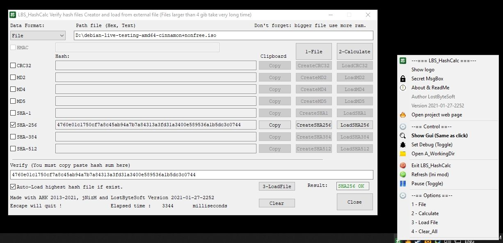
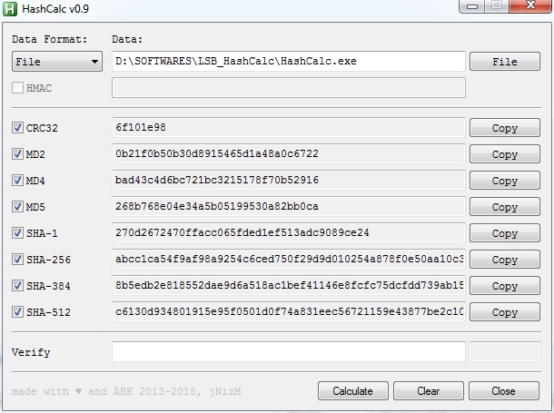
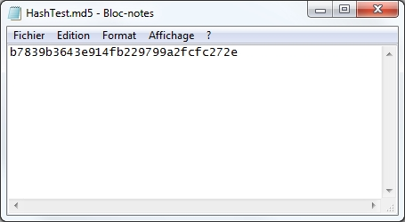
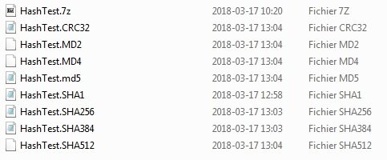
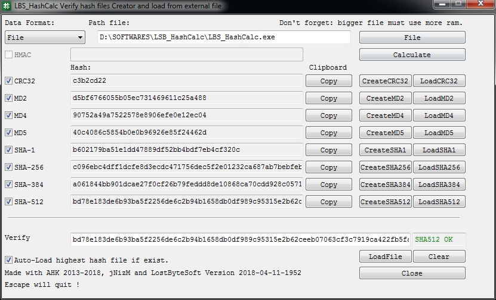
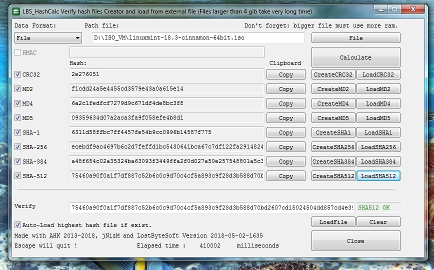
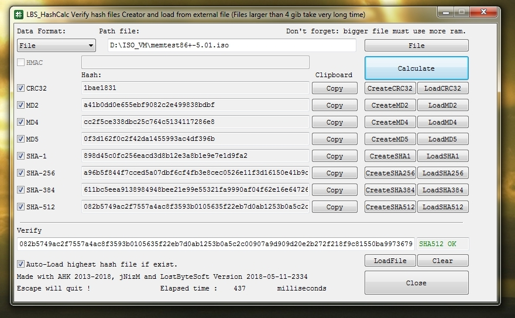
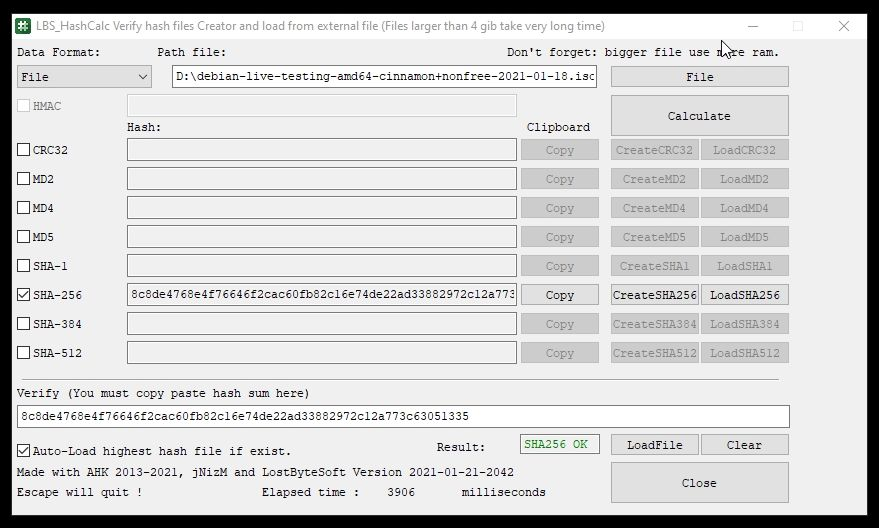
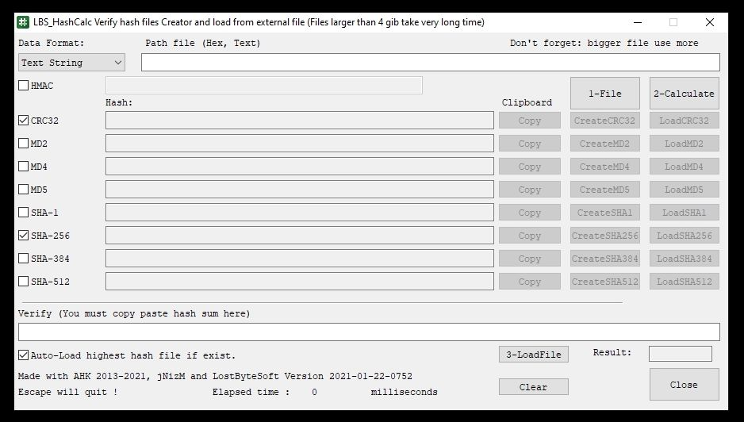

# HashCalc

Updated: 2021-06-20 to support win 11

THIS IS A FORKED WORK FROM jNizM

## What is different from the fork work compared to original ?

* I added some functions (load and create)
* Review the GUI. (Calculate button, ... some other)
* Icons for the program
* Icons for the menu in tray bar
* Auto-Load for hash file if present

Calculate hash from string, hex or file via AutoHotkey many options added.
* create files (*.md5 *.sha1 ... etc)
* load from file
* Gui arrangement
* Direct load hash files

## Features
* Generate hash value from string, hex or file
* Secure-Salted function
* Verify hash
* Load md5 sha ... etc from a file

### Hash Functions
* CRC32
* MD2, MD4, MD5
* SHA-1
* SHA-256, SHA-384, SHA-512
* HMAC

## Screenshot
* Actual version

* Original version

## How to use it ?
* Click "File" to load something (larges files takes time...)
* Click on "Calculate" and wait
* Click on LoadMD5 if you have a file who respect the format
OR
* Copy Paste the hash in "Verify" edit line
OR
* Click "LoadFile" to load any hash file to auto compare

## What is the correct format for hash file ?
* A file with the same name of the file you want verify
* Inside this file on the first line include the hash
* The extension of this file is *.crc32 *.md2 *.md4 *.md5 *.sha1 *.sha256 *.sha384 *.sha512
* Extension *.txt is accepted too (or no extension)
* Look image for easy-way

## Contributing

* THANKS ORIGINAL MAKER jNizM

* thanks to Bentschi for his functions CalcAddrHash(), CalcStringHash() & CalcFileHash()
* thanks to atnbueno for CalcHexHash()
* thanks to SKAN for his functions CRC() & FileCRC32()
* thanks to jNizM translated function HMAC()
* thanks to AutoHotkey Community

THIS IS A FORKED WORK FROM jNizM

18 553 bytes original jNizm

38 575 bytes LostByteSoft (version 2018-03-18)

40 835 bytes LostByteSoft (version 2018-05-11)

41 312 bytes LostByteSoft (version 2021-01-27)

## Comparing Versions

