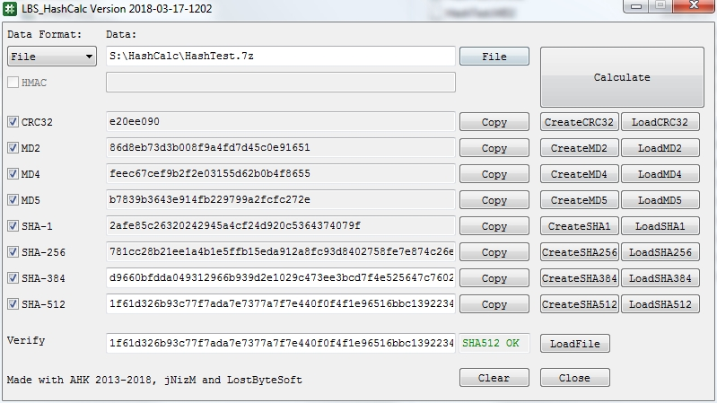

# HashCalc ORIGINAL by jNizM
Calculate hash from string, hex or file via AutoHotkey many options added.
* create files (*.md5 *.sha1 ... etc)
* load from file
* gui arrangement
* direct load hash files

## Features
* Generate hash value from string, hex or file
* Secure-Salted function
* Verify hash
* Load md5 sha ... etc from a file

### Hash Functions
* CRC32
* MD2, MD4, MD5
* SHA-1
* SHA-256, SHA-384, SHA-512
* HMAC

## Screenshot

## Contributing

* THANKS ORIGINAL MAKER jNizM

* thanks to Bentschi for his functions CalcAddrHash(), CalcStringHash() & CalcFileHash()
* thanks to atnbueno for CalcHexHash()
* thanks to SKAN for his functions CRC() & FileCRC32()
* thanks to just me for his translated function HMAC()
* thanks to AutoHotkey Community
